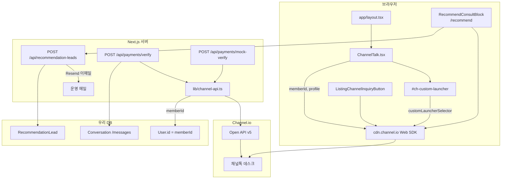

# 도쿄민박 서비스 ↔ 채널톡(Channel.io) 연동 현황

이 문서는 **현재 코드 기준**(2026-06-03)으로 우리 프로덕트(Next.js)와 채널톡이 어떻게 연결되어 있는지 한곳에 정리합니다.  
운영·ALF·API 키 발급은 아래 관련 문서를 함께 보세요.

| 문서 | 용도 |
|------|------|
| [채널톡-활용-가이드.md](./채널톡-활용-가이드.md) | 상담 운영·ALF·효과 극대화 |
| [채널톡-API키-설정.md](./채널톡-API키-설정.md) | Open API 키 Vercel 등록 |
| [채널톡-예약확정-알림-구현-기획.md](./채널톡-예약확정-알림-구현-기획.md) | 결제 확정 알림 구현 이력·미구현 항목 |
| [채널톡-운영자-상담맥락.md](./채널톡-운영자-상담맥락.md) | 데스크 프로필 `tokyominbak*` 필드·운영 설정 |

---

## 1. 연동 요약 (구현 상태)

| # | 연동 | 방식 | 상태 | 비고 |
|---|------|------|------|------|
| A | **전역 채팅 위젯** | Web SDK `boot` + 커스텀 런처 | ✅ 구현 | 모든 페이지 (`layout.tsx`) |
| B | **숙소 상세 「숙소 문의」** | Web SDK `track` / `setPage` / `addTags` | ✅ 구현 | `ListingChannelInquiryButton` |
| C | **추천 `/recommend` 「상담 시작하기」** | Web SDK + 리드 API | ✅ 구현 | 실패 시 카카오 **폴백**만 |
| D | **결제 확정 봇 알림** | Open API v5 | ✅ 구현 | `verify` / `mock-verify`만 |
| E | **채널톡 → 우리 서버 Webhook** | — | ❌ 없음 | 인바운드 연동 없음 |
| F | **즉시 예약(무결제) 확정 알림** | — | ❌ 없음 | 기획 문서에만 선택 항목 |
| G | **Beds24 / Portone / cron** | — | ❌ 없음 | 채널톡 미사용 |

---

## 2. 상담 채널 역할 분리

서비스에는 **목적이 다른** 문의·메시지 경로가 있습니다.

| 경로 | 기술 | 주 용도 | 대상 |
|------|------|---------|------|
| **채널톡** | Channel.io Web SDK (+ 일부 Open API) | 일반 CS, 숙소 문의, 추천 상담, 결제 확정 안내 | 게스트(비로그인 포함) |
| **사이트 내 메시지** | Prisma `Conversation` / `/messages` | 예약 확정 후 호스트↔게스트 대화 | 로그인 게스트·호스트 |
| **카카오 채널** | `NEXT_PUBLIC_KAKAO_CHANNEL_CHAT_URL` | 추천 퍼널에서 **채널톡 열기 실패 시** 대체 링크 | `/recommend` 이용자 |

- **채널톡 런처**: 우측 하단 주황 버튼 (`#ch-custom-launcher`). 모바일은 하단 `BottomNav` 위.
- **추천 퍼널 기본 UX**: 「상담 시작하기」→ DB 리드 저장 → **채널톡 메신저** 오픈. 카카오는 보조 경로.

---

## 3. 연동 구조 (다이어그램)

---

## 4. 클라이언트 — 전역 위젯 (연동 A)

### 4.1 마운트

| 항목 | 값 |
|------|-----|
| 컴포넌트 | `src/components/channel/ChannelTalk.tsx` |
| 로드 위치 | `src/app/layout.tsx` — Header/Footer/BottomNav와 함께 **전 페이지** |

### 4.2 Web SDK

| 항목 | 동작 |
|------|------|
| 스크립트 | `https://cdn.channel.io/plugin/ch-plugin-web.js` (async) |
| 부트 지연 | 마운트 후 **4초**, 가능 시 `requestIdleCallback` |
| `pluginKey` | `NEXT_PUBLIC_CHANNEL_PLUGIN_KEY` (미설정 시 코드 fallback) |
| 언어 | `HostLocaleProvider` → `ko` / `ja` |
| 기본 버튼 | `hideChannelButtonOnBoot: true` |
| 런처 | `customLauncherSelector: "#ch-custom-launcher"` |

### 4.3 사용자 식별 (`memberId`)

- 로그인 시: `memberId` = `session.userId` ?? `session.user.id` (DB `User.id`와 동일 문자열)
- 비로그인: `memberId` 없이 부트
- 로그인 후 `updateUser`: `profile.name`, `profile.email`
- `onBadgeChanged`: 미읽음 수 → 커스텀 런처 뱃지

### 4.4 UI

- `createPortal` → `document.body` 고정
- 모바일: `bottom: calc(4rem + 80px + safe-area)` (BottomNav 회피)
- 데스크톱: `right-6`, `bottom-6`
- 기본 채널톡 버튼은 Shadow DOM → `src/app/globals.css` 주석대로 **커스텀 런처 필수**

### 4.5 타입

- `src/types/channel.d.ts` — `window.ChannelIO`, `ChannelIOInitialized`

---

## 5. 클라이언트 — 숙소 상세 문의 (연동 B)

### 5.1 컴포넌트

- `src/components/channel/ListingChannelInquiryButton.tsx`
- 사용: `src/app/listing/[id]/ListingDetailContent.tsx` (호스트 섹션)

### 5.2 클릭 시 ChannelIO 호출

| API | 전달 내용 |
|-----|-----------|
| `track("Guest listing inquiry", …)` | `listingId`, `listingTitle`, `pageUrl` |
| `setPage(url, chatProfile)` | `inquiryListingId`, `inquiryListingTitle`, `inquiryPageUrl`, `lastInquiryListingSummary` |
| `updateUser({ profile })` | 위 필드 + 로그인 시 name/email |
| `addTags` | `listing_inquiry`, `listing_{id}` (소문자·64자 제한) |
| `showMessenger` | 메신저 열기 |
| 운영자 맥락 | `tokyominbak*` — URL query의 일정·인원(`parseListingBookingPrefill`) 반영 |

언마운트 시: `resetPage`, `removeTags`, 문의·`tokyominbak*` profile 필드 초기화.

### 5.3 예약·메시지와의 관계

- 예약·결제: 동 페이지 `BookingForm` — 채널톡과 **무관**
- 예약 확정 후 대화: **`/messages`** (내부 Conversation)

---

## 6. 클라이언트 — 추천 퍼널 상담 (연동 C)

### 6.1 UI·플로우

- 컴포넌트: `src/components/recommend/RecommendConsultBlock.tsx`
- 페이지: `src/app/recommend/RecommendPageContent.tsx`
- 유틸: `src/lib/recommend-channel-talk.ts` (**서버 import 금지**)

**「상담 시작하기」 클릭 시:**

1. `POST /api/recommendation-leads` — `contactMethod: "channel"`, 조건·추천 숙소 ID 등 저장 → `leadCode` 발급
2. (선택) `RECOMMENDATION_LEAD_NOTIFY_EMAIL` → Resend로 **운영자 이메일** (채널톡 API 아님)
3. `openRecommendChannelConsult(ctx)` — SDK 부트 대기(최대 4초, 재시도) 후 메신저 오픈
4. 실패 시: 「상담창 다시 열기」 + **카카오 채널 URL** 링크 (`recommend_kakao_click` 이벤트)

### 6.2 채널톡에 넘기는 정보 (PII·freeText 의도적 미전달)

| API | 내용 |
|-----|------|
| `track("Recommendation lead inquiry", …)` | 일정, 인원, 지역·우선순위 라벨, 추천 숙소 ID/제목(최대 3), `leadCode`, UTM 출처 + **`tokyominbak*` 운영자 맥락** |
| `setPage` / `updateUser.profile` | 기존 `recommend*` 필드 + **`tokyominbakContextSummary` 등** (`src/lib/channel-context-summary.ts`) |
| `addTags` | `recommendation_lead`, `recommend_consultation` |
| `showMessenger` | 메신저 열기 |

운영자 필드·데스크 설정: [채널톡-운영자-상담맥락.md](./채널톡-운영자-상담맥락.md)

### 6.3 분석 이벤트 (`recommend-analytics`)

- `recommend_consult_start_click`
- `recommend_consult_lead_created` / `recommend_lead_submit` (`contact_method: channel`)
- `recommend_channeltalk_open` / `recommend_channeltalk_open_failed`
- `recommend_kakao_click` (폴백만)

### 6.4 개인정보 문구

- `src/lib/policy-content.ts`: 추천 상담은 **웹 채팅(채널톡)** 연결, 식별번호·조건이 상담창·운영 시스템에 전달될 수 있음

---

## 7. 서버 — Open API 결제 확정 알림 (연동 D)

### 7.1 목적

결제(또는 모의 결제) **검증 성공 후**, 게스트 채널톡에 **봇 텍스트 1통**.  
동시에 기존대로 **`/messages/[conversationId]`** 리다이렉트 유지.

### 7.2 호출 위치

| API | 파일 |
|-----|------|
| 실결제 | `src/app/api/payments/verify/route.ts` |
| 모의 결제 | `src/app/api/payments/mock-verify/route.ts` |

고정 문구:

> 예약이 확정되었습니다. 메시지창에서 자세한 내용을 확인하세요.

### 7.3 `src/lib/channel-api.ts`

| 항목 | 내용 |
|------|------|
| Base URL | `https://api.channel.io/open/v5` |
| 인증 | `x-access-key`, `x-access-secret` ← `CHANNEL_ACCESS_KEY`, `CHANNEL_ACCESS_SECRET` |
| 미설정 | 함수 즉시 return — 결제 API는 **200·conversationId 유지** |
| 순서 | `GET /users/@{memberId}` → `POST /users/{id}/user-chats` → `POST /user-chats/{id}/messages` (`blocks: [{ type: "text", value }]`) |
| 실패 | `console.error`만, **예외 미전파** |

### 7.4 전제·한계

- 게스트가 로그인 결제 + 과거 **`memberId`로 부트**한 적 있어야 User 조회 가능 (404면 알림 skip)
- **비로그인 결제·즉시 예약(무결제)·Portone webhook** 등 다른 확정 경로에는 **미연동**

---

## 8. 환경 변수

| 변수 | 노출 | 용도 |
|------|------|------|
| `NEXT_PUBLIC_CHANNEL_PLUGIN_KEY` | 클라이언트 | Web SDK `pluginKey` |
| `CHANNEL_ACCESS_KEY` | 서버만 | Open API |
| `CHANNEL_ACCESS_SECRET` | 서버만 | Open API |
| `NEXT_PUBLIC_KAKAO_CHANNEL_CHAT_URL` | 클라이언트 | 추천 퍼널 채널톡 **실패 시** 카카오 링크 |
| `RECOMMENDATION_LEAD_NOTIFY_EMAIL` | 서버만 | 추천 리드 운영 메일 (Resend, 채널톡과 별도) |

`.env.example` 172–177행 주석 참고.

| 키 설정 | 위젯·숙소/추천 문의 | 결제 확정 봇 |
|---------|---------------------|--------------|
| Plugin Key만 | ✅ | ❌ |
| Open API 키 추가 | ✅ | ✅ (memberId 매칭 시) |

---

## 9. 보안 (CSP)

`next.config.mjs` Content-Security-Policy 허용 예:

- **script:** `cdn.channel.io`, `wcs.channel.io`
- **connect:** `api.channel.io`, `*.channel.io`, `wss://*.channel.io`, `*.desk-ws.channel.io` 등
- **img / style / font / frame / media:** `*.channel.io`, `cdn.channel.io` 등

외부 이미지·데스크 설정 이슈 → [채널톡-활용-가이드.md](./채널톡-활용-가이드.md).

---

## 10. 개인정보·위탁

| 항목 | 위치 |
|------|------|
| 위탁 수탁 | `policy-content.ts` — **Channel.io(채널톡)**, 웹 고객 문의 채팅 접수·응대 |
| 전달 가능 정보 | 로그인 시 이름·이메일; 숙소 문의 시 숙소 ID·제목·URL; 추천 상담 시 일정·인원·조건 라벨·`leadCode`·추천 숙소 요약; 사용자가 입력한 채팅 내용 |

---

## 11. 관련 소스 파일

| 구분 | 경로 |
|------|------|
| 전역 위젯 | `src/components/channel/ChannelTalk.tsx` |
| 숙소 문의 | `src/components/channel/ListingChannelInquiryButton.tsx` |
| 추천 상담 UI | `src/components/recommend/RecommendConsultBlock.tsx` |
| 추천 SDK 유틸 | `src/lib/recommend-channel-talk.ts` |
| 운영자 맥락 포맷 | `src/lib/channel-context-summary.ts` |
| Open API | `src/lib/channel-api.ts` |
| 결제 연동 | `src/app/api/payments/verify/route.ts`, `mock-verify/route.ts` |
| 추천 리드 API | `src/app/api/recommendation-leads/route.ts` |
| 레이아웃 | `src/app/layout.tsx` |
| 타입 | `src/types/channel.d.ts` |
| CSP | `next.config.mjs` |
| 정책 | `src/lib/policy-content.ts` |

---

## 12. 채널톡과 연결되지 않은 영역

| 영역 | 설명 |
|------|------|
| `/messages` | Prisma 기반 호스트↔게스트 메시지 (채널톡 아님) |
| 예약 생성만으로 확정 | `bookings` 등 — Open API 알림 없음 |
| Beds24 / iCal / 재고 | 외부 PMS, 채널톡 무관 |
| Portone webhook / `charge-deferred` cron | 결제·빌링, 채널톡 무관 |
| 채널톡 Webhook → 우리 API | 미구현 |
| ALF·시나리오 봇 | 코드 없음 — 데스크·[활용 가이드](./채널톡-활용-가이드.md)에서 설정 |

---

## 13. 운영·장애 체크리스트

| 증상 | 확인 |
|------|------|
| 런처 안 보임 | `NEXT_PUBLIC_CHANNEL_PLUGIN_KEY`, CSP, 광고 차단 |
| 런처는 보이나 채팅 안 열림 | SDK 네트워크, `ChannelIO` stub, 4초 부트 전 클릭 |
| 추천 「상담 시작」 후 창 안 열림 | SDK 미준비(`not_ready`), Vercel 로그, 재시도·카카오 폴백 |
| 결제 후 채널톡 알림 없음 | `CHANNEL_ACCESS_*`, memberId 부트 이력, `[ChannelAPI]` 로그 |
| 결제는 됐는데 알림만 실패 | **의도된 동작** — `/messages` 리다이렉트 유지 |
| 데스크에 태그·프로필 안 보임 | 채널톡 데스크 프로필 필드·태그 매핑 설정 |
| 추천 리드는 DB에 있는데 상담 컨텍스트 없음 | 사용자가 리드 저장 전 이탈, 또는 SDK 실패 후 카카오만 이용 |

---

## 14. 변경 시 주의

- `memberId`는 **항상 `User.id` 문자열** 유지 (Open API 매칭).
- `hideChannelButtonOnBoot` 유지 — 기본 버튼은 모바일 BottomNav와 겹침.
- 추천 상담은 **이름·이메일·freeText를 채널톡 profile에 넣지 않음** — 정책·스코프 유지.
- Open API는 **UserChat을 매 결제마다 생성** — 채널톡 쪽 대화 스레드 정책 변경 시 `channel-api.ts`만 수정.

---

*마지막 갱신: 코드베이스 전수 검색 기준 — ChannelTalk, ListingChannelInquiryButton, recommend-channel-talk, RecommendConsultBlock, channel-api, payments verify/mock-verify, recommendation-leads, layout, next.config CSP, policy-content.*
